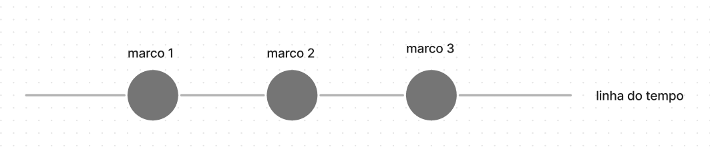
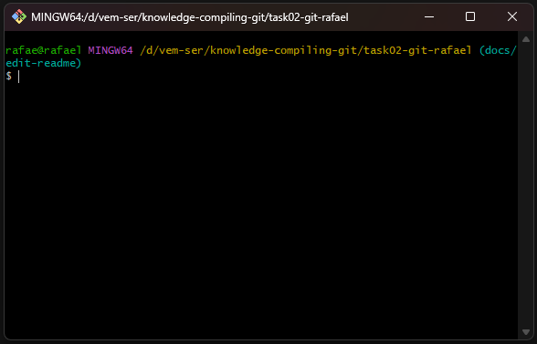
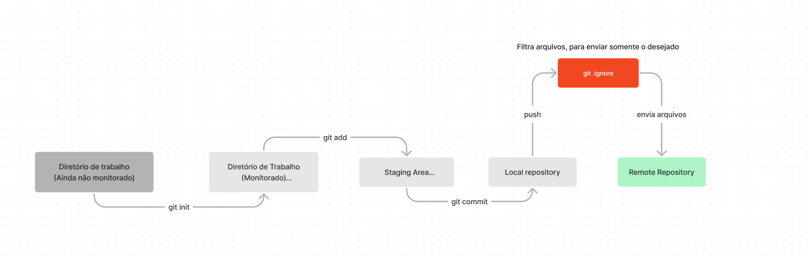
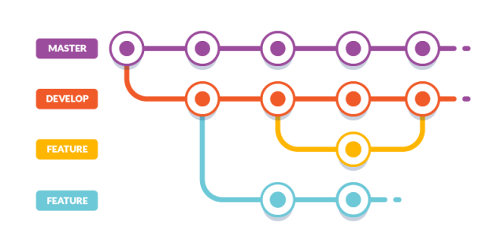

# Aprendizados sobre Git

 

Confira meu mapa mental dos conteúdos <a href="https://www.figma.com/file/zSjDSl2ZmnaCM8xOEEKwQR/Untitled?node-id=0%3A1&t=i8Cp9XkNEHt5aYfV-1" target="_blank">Clique Aqui!</a>

## 📕 Sumário

-   [O Git](#o-git)
-   [Principais ferramentas](#principais-ferramentas)
    -   [Github](#github)
    -   [GitKraken](#gikraken)
    -   [BitBucket](#bitbucket)
    -   [GitLab](#gitlab)
    -   [SmartGit](#smartgit)
    -   [Terminais](#terminais)
-   [Funcionamento](#funcionamento)
-   [Branches](#branches)
    -   [Nomenclatura](#nomenclatura)
    -   [Hierarquia](#hierarquia)
    -   [Convenções](#convencoes)
-   [PR e Code Review](#pr-e-code-review)
-   [Principais Comandos](#comandos)

 

## O Git

Ao longo destas 2 aulas aprendemos que Git é uma ferramenta de controle de versão facilitadora, que permite com que desenvolvedores tenham um controle das versões de seus projetos, além de poderem salvar alterações, reverter seus códigos ou até mesmo publicarem as suas soluções, através das [principais ferramentas do mercado,](#principais-ferramentas) com seus squads ou comunidade, trabalhando de forma tanto assíncrona quanto síncrona com outros desenvolvedores.

Imagine o git como uma linha do tempo, juntamente com outras linhas secundárias, sendo possível definir marcos nesta linha de acordo com checkpoints relevantes de desenvolvimento. É possível retornar nestes marcos e vizualizar tudo que aconteceu naquele período o que facilita muito na documentação de um projeto.

> Mais para frente veremos que existem nomes técnicos específicos para os "Marcos" e também para as Linhas do tempo.

Saber Git atualmente é um **requisito** para o mercado de TI tendo em vista que atualmente uma solução pode impactar inúmeras vidas como é o caso do Ifood e Uber. Essas soluções, por exemplo, devem manter um padrão de qualidade e com isso, surgem inúmeras ferramentas que os desenvolvedores **devem** dominar para que sejam cada vez mais reduzidas as chances de erro.

  

## Principais ferramentas

### Github

O [Github](https://github.com/) é uma das principais ferramentas utilizadoras do Git sendo popular no mercado de TI pelo seu open source, facilitações no controle de git-flows e por ser propriedade de uma empresa renomada como a Microsoft

### GitCracken

O [GitKraken](https://www.gitkraken.com/) possui uma interface mais intuitiva e embelezada, que pode facilitar na hora de controlar as versões de um projeto, entretanto, por conta dessas funcionalidades acaba sendo um recurso pago

### BitBucket

Possuindo um recurso de integração com o Jira (controle de tarefas no modelo Kanban) o [BitBucket](https://bitbucket.org/product/) é uma solução Open DevOps daAtlassian.

### GitLab

Desde o planejamento para produção o [GitLab](https://about.gitlab.com/) une os times , reduzindo custos, aumentando a segurança e a produtividade dos desenvolvedores que optam por utilizar a ferramenta.

### Smart Git

O [Smart Git](https://www.syntevo.com/smartgit/) não só auxilia usuários novatos em git, mas também, faz com que desenvolvedores mais experientes trabalhem de forma mais produtiva.

  

## Terminais

Atualmente existem várias formas de escrevermos comandos git. Desde interfaces gráficas disponibilizadas nas próprias IDE's até os tradicionais _CLI_ (_command line interface_)

Um exemplo deles é o git bash:

Neste, escrevemos os comandos, levando em consideração a sua correta sintaxe.

 

## Funcionamento

O git, possui um fluxo próprio, assim que iniciado, monitorando todos os arquivos e todas a linhas de código alteradas, adicionadas ou removidas. O processo é similar ao da representação abaixo:

Perceba que foram utilizados determinados comandos para que o Fluxo do git seguisse para as próximas etapas. Confira a seção [comandos](#comandos) para conferir a função de cada um dos comandos aprendidos em aula.

Sobre os estados após o `git init` temos:

| Estados  | Descrição                                             |
| -------- | ----------------------------------------------------- |
| Modified | Arquivo alterado, porém ainda sem commit registrado   |
| Commited | Dados armazenados no banco local                      |
| Staged   | Arquivos marcados e adicionados para serem commitados |

Assim logo após **inicializado** o git localmente, **adicionados** arquivos para um marco na história (Commit), **marcado** arquivos para serem enviados para um repositório remoto, **filtrado** arquivos indesejados, que possuem finalidades somente em repositórios locais somente então o commit é enviado para o **repositório remoto**

## Branches

As branches servem para que seja possível estabelecer uma organização através de um trabalho contínuo e que na maioria das vezes é realizado de forma assíncrona por diversos desenvolvedores.

A possibilidade de estabelecer diferentes fluxos de trabalho com determinadas regras e convenções faz com que empresas possam controlar o fluxo de desenvolvimento evitando falhas antes de subir uma aplicação para produção. Conforme visualizado no esquema abaixo:

Observando a imagem vemos que cada linha possuí uma cor o que corresponde a uma branch diferente que por fim se conectam a branch master que seria a branch de produção

> O nome da principal branch de produção deixou de se chamar "Master" e passou ser **"Main"**, por master possuir uma conotação negativa com alusão a mestres e subordinados.

Portanto, no desenvolvimento temos nomes específicos para a criação de branches. Os mais comuns são:

Branches do workflow (exemplos)

-   **main** - Que envia todo o código para a produção
-   **develop** - Que envia o código para revisão antes de ir para produção. Confira [PR e code Review!](#pr-e-code-review)

Branches secundárias

-   **docs** - Para realizar mudanças em arquivos de documentação, como "README".
-   **feat** - Para a adição de novas funcionalidades as aplicações.
-   **fix** - Para a correção de bugs.
-   **perf** - Para mudanças performáticas no código.
-   **style** - Para mudanças no código que não alteram a funcionalidade ou semâmtica (espaços em branco, formatação, ponto e vírgula, comentários, etc.).
-   **refactor** - Mudanças de código que não adicionam funcionalides, mas também não corriger bugs..
-   **test** - Para criar ou corrigir testes de aplicação.

Assim o nome das branches seguem, um determinado formato popular:

`nome-específico-da-branch + objetivo/funcionalidade/significado + id-da-task`

Exemplos:

-   **docs**/create-edit-readme-Ts-1407
-   **feat**/create-blog-survey-Ts-1408

## PR e Code Review

A última etapa do desenvolvimento após subir os códigos é enviá-los para sofrerem um PR ou _pull request_. O PR é basicament o ato de pedir a permissão para que o seu código seja mesclado a uma das branches principais para que de fato vá para a produção no futuro. Este processo geralmente é realizado por um **Code Reviewer** que pode ser o seu **Tech Lead**. Este profissional geralmente verifica o seu código avalia o conteúdo, identifica se está coerente com o pedido, se não há falhas ou se poderá danificar os códigos da branch principal para somente então aprovar o seu código de ser enviado. Seria algo como:

feat -> Code Review -> Aprovado? -> develop -> main(futuramente)

feat -> Code Review -> Reprovado? -> Ajustes na feat -> Code Review -> Aprovado? -> develop -> main(futuramente)

> Branches podem gera conflitos em algumas linhas de código, portanto, além de seguir o workflow, desenvolvedores devem manter contato constantemente. Porém resolver conflitos atualmente foi bastante facilitado pelas tecnologias atuais.

## Comandos

> Comandos Aprendidos

<table>
    <tr>
        <th>Comando</th>
        <th>Descrição</th>
    </tr>
    <tr>
        <td><code>git init</code></td>
        <td>Inicializa o repositório git localmente</td>
    </tr>
    <tr>
        <td><code>git status</code></td>
        <td>Confere os estados do git</td>
    </tr>
    <tr>
        <td><code>git checkout</code></td>
        <td>Verifica as branches do projeto</td>
    </tr>
    <tr>
        <td><code>git checkout -b (nome-da-branch)</code></td>
        <td>Cria uma nova branch</td>
    </tr>
    <tr>
        <td><code>git add (nome do arquivo) ou . (tudo)</code></td>
        <td>Adicionar arquivos para serem commitados</td>
    </tr>
        <tr>
        <td><code>git commit -m 'message'</code></td>
        <td>Envia o commit com uma descrição</td>
    </tr>
    </tr>
    <tr>
        <td><code>git push origin (branch)</code></td>
        <td>Envia os códigos commitados do repo local para remoto desejado</td>
    </tr>
    <tr>
        <td><code>git pull</code></td>
        <td>Baixa alterações encontradas do repositório remoto para o local</td>
    </tr>
    <tr>
        <td><code>git merge (branch)</code></td>
        <td>Realiza uma mesclagem das branchs *Pode gerar conflitos</td>
    </tr>
        <tr>
        <td><code>git reset (mode)</code></td>
        <td>Desfaz mudanças de acordo com o modo definido</td>
    </tr>
    <tr>
        <td><code>git fetch</code></td>
        <td>Realiza uma busca para verificar se há alterações no repositório remoto</td>
    </tr>
    <tr>
        <td><code>git squash</code></td>
        <td>O comando squash é uma funcionalidade do comando git merge, utilizando o squash é possível juntar commits de uma branch qualquer a branch main em um só commit.<a href="https://github.com/RafaelR4mos/task01-grupo03" target="_blank"> Saiba mais</a></td>
    </tr>
    <tr>
        <td><code>git cherry pick</code></td>
        <td>O comando git cherry-pick  possibilita selecionar commits de sua escolha, vindos de uma branch diferente sendo simplesmente baseado na ação de selecionar um commit de uma branch e aplicar a outra.<a href="https://github.com/RafaelR4mos/task01-grupo03" target="_blank"> Saiba mais</a></td>
    </tr>
    <tr>
        <td><code>git rebase</code></td>
        <td>Permite que você transfira seus commits de um branch para outro diferente. Isso pode ser útil para sincronizar o seu trabalho com as alterações recentes ou para resolver conflitos antes de realizar o merge. <a href="https://github.com/RafaelR4mos/task01-grupo03" target="_blank"> Saiba mais</a></td>
    </tr>
    <tr>
        <td><code>git revert</code></td>
        <td>Git revert é um comando que reverte o que foi feito dentro de um ou mais commits.<a href="https://github.com/RafaelR4mos/task01-grupo03" target="_blank"> Saiba mais</a></td>
    </tr>
</table>

## Fontes

Bibliografia e recursos gráficos

-   https://www.alura.com.br/artigos/o-que-e-git-github
-   https://git-scm.com/doc
-   https://douglasabnovato.medium.com/o-seu-fluxo-de-trabalho-no-git-2249346468e
-   https://gitfichas.com/
-   https://www.atlassian.com/br/git/tutorials/comparing-workflows/gitflow-workflow
-   https://www.alura.com.br/artigos/git-flow-o-que-e-como-quando-utilizar#:~:text=O%20Git%20Flow%20trabalha%20com,merge%20com%20as%20branches%20principais
-   https://dev.to/nopenoshishi/understanding-git-through-images-4an1
-   https://www.atlassian.com/git/tutorials/undoing-changes/git-reset#:~:text=To%20review%2C%20git%20reset%20is,correspond%20to%20the%20three%20trees.

---

made with 💙 by Rafael Ramos
